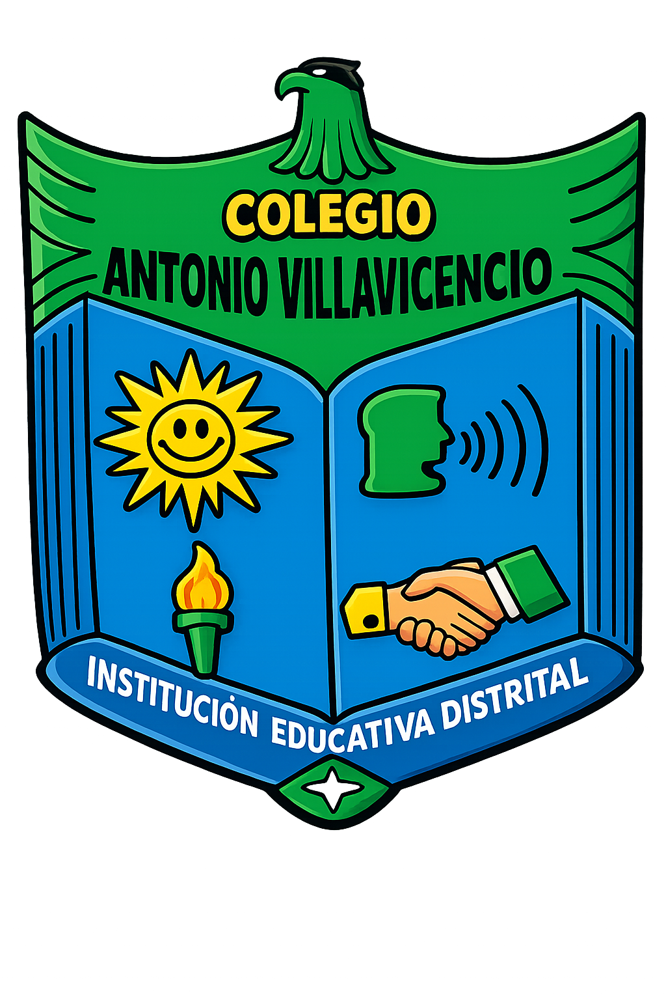
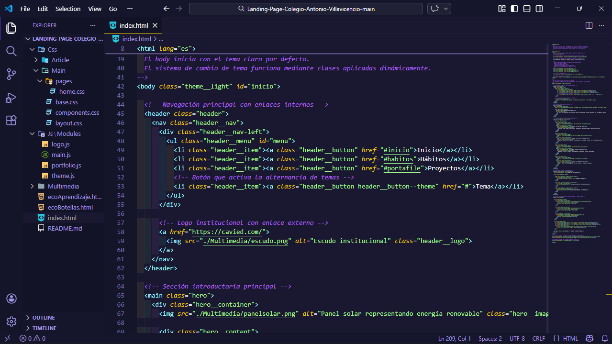
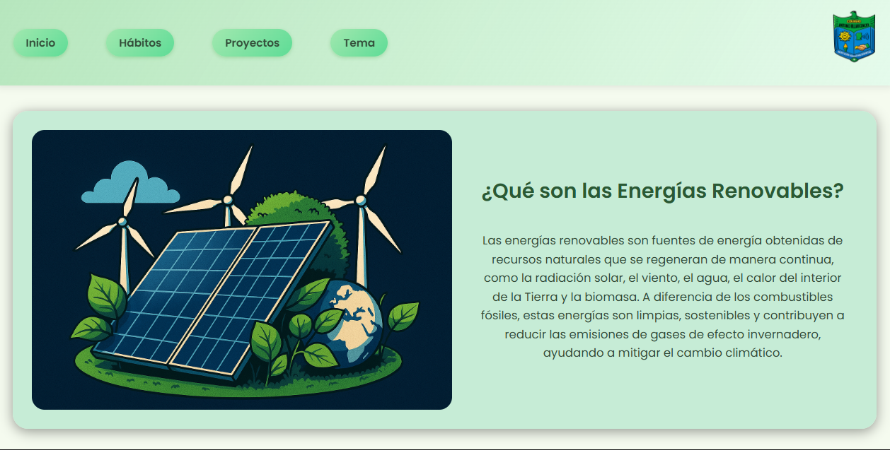
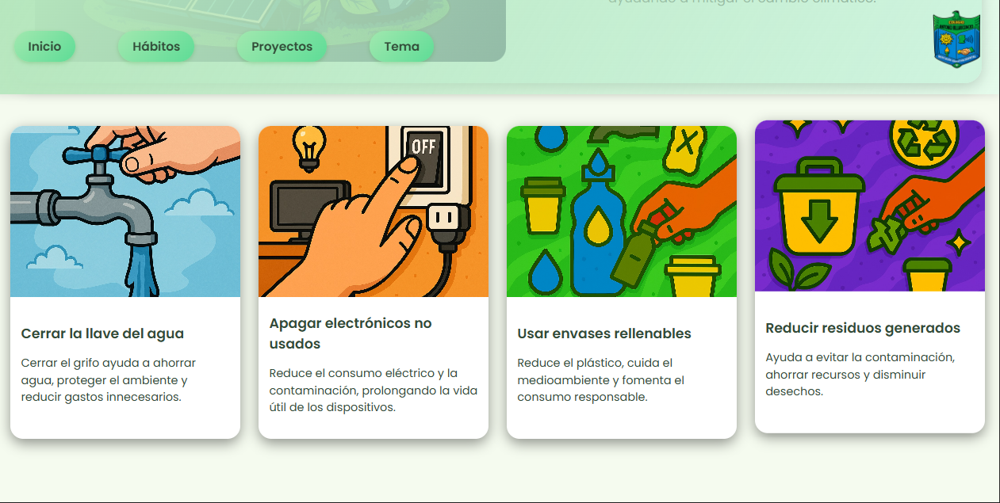
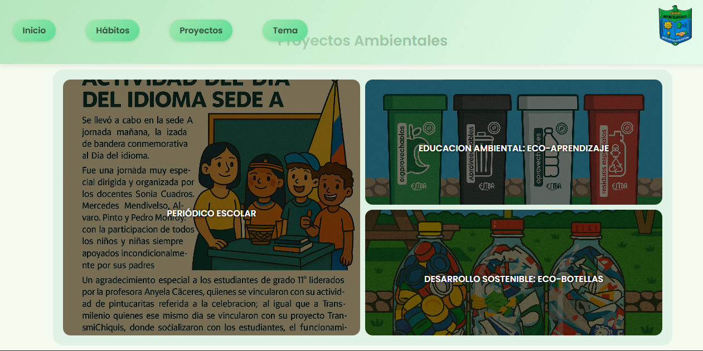

# Plataforma Web de Proyectos Ambientales 2025  
Colegio Antonio Villavicencio

Deploy del proyecto: https://antoniovillavicencio.netlify.app/

  

Aplicación web desarrollada para visibilizar los proyectos ambientales liderados por los estudiantes de grado 11 jornada mañana del Colegio Antonio Villavicencio durante el año 2025. El sitio funciona como una vitrina digital estructurada que documenta procesos, evidencia impacto y promueve conciencia sobre energías renovables y sostenibilidad ambiental desde un entorno escolar.

---

## 1. Descripción general del proyecto  

Esta landing page surge como una iniciativa académica orientada a centralizar y proyectar públicamente las iniciativas ambientales desarrolladas durante el año lectivo 2025. La intención principal fue crear un espacio web profesional, claro y accesible que permitiera mostrar el trabajo realizado por los estudiantes, integrando contenido pedagógico con una estructura técnica sólida.

El eje temático del sitio es la educación sobre energías renovables y la promoción de hábitos sostenibles que pueden implementarse tanto en el hogar como en el entorno escolar. A partir de esta base conceptual, la plataforma conecta al usuario con proyectos específicos como EcoAprendizaje, Eco-botellas y el periódico escolar ambiental, articulando cada uno dentro de una narrativa estructurada y coherente.

El tono comunicativo es comprensible y amigable, manteniendo claridad conceptual y coherencia formal en la presentación de la información.

---

## 2. Enfoque técnico y tecnologías utilizadas  

El proyecto fue desarrollado utilizando HTML5 para la estructura semántica, CSS3 para el diseño visual y JavaScript puro para la interactividad. No se emplearon frameworks externos, con el propósito de demostrar dominio directo del DOM y control total del comportamiento de la interfaz.

  
  
  

La organización del código sigue una lógica modular y aplica la metodología BEM (Block Element Modifier), lo que permite mantener una nomenclatura consistente, evitar colisiones de estilos y facilitar el mantenimiento futuro. Esta arquitectura favorece la escalabilidad y la claridad estructural del sistema.

  

---

## 3. Estructura de la página principal  

La landing está organizada en tres secciones estratégicas que cumplen funciones diferenciadas dentro de la experiencia del usuario.

La primera sección presenta una tarjeta visual introductoria donde se explica qué son las energías renovables y cuál es su impacto ambiental y social. Esta parte establece el marco conceptual desde el cual se desarrollan los proyectos.

  

La segunda sección contiene cuatro tarjetas informativas que desarrollan hábitos concretos orientados a la sostenibilidad. El contenido se enfoca en acciones prácticas que pueden implementarse en la vida diaria para reducir el impacto ambiental.

  

La tercera sección está compuesta por un collage interactivo. Cada elemento visual funciona como acceso directo a uno de los proyectos. Al interactuar con los distintos componentes, el usuario es redirigido al artículo correspondiente, integrando diseño visual e interactividad controlada con JavaScript.

  

---

## 4. Estructura interna de los proyectos  

Cada proyecto está construido bajo un formato tipo artículo utilizando el modelo de diseño conocido como “Santo Grial”, estructurado en tres columnas. La columna izquierda incorpora una tabla de contenidos que facilita la navegación interna en artículos extensos. La columna central concentra el desarrollo completo del contenido, mientras que la columna derecha incluye una frase conceptual relacionada con el proyecto, reforzando su identidad temática.

El contenido de cada proyecto sigue una secuencia narrativa que aborda el contexto ambiental, el origen de la iniciativa, la propuesta planteada, su valor educativo, testimonios, actividades desarrolladas, cronograma, investigación adicional, impacto en la comunidad, dificultades enfrentadas y una conclusión reflexiva.

Al final del contenido principal se incorpora una sección de preguntas frecuentes (FAQ) que amplía información y resuelve dudas específicas.

Proyecto EcoAprendizaje: 

  

Proyecto EcoBotellas: 

  

---

## 5. Interactividad y sistema visual  

La interactividad del sitio está gestionada completamente con JavaScript puro. El collage principal permite redirección dinámica a cada proyecto, mientras que la tabla de contenidos de los artículos facilita la navegación interna mediante anclas estructuradas.

  

El sistema incorpora un modo oscuro que permite alternar entre tema claro y tema oscuro, mejorando la accesibilidad visual y la experiencia del usuario en distintos entornos de iluminación. Esta funcionalidad está implementada mediante manipulación dinámica de clases y variables CSS.

  

Asimismo, la plataforma incluye diferentes paletas de colores configuradas a través de variables CSS, lo que permite modificar el esquema visual sin alterar la estructura base del diseño. Esta decisión técnica facilita personalización y escalabilidad del sistema visual.

---

## 6. Responsive Design  

El proyecto fue diseñado bajo un enfoque completamente adaptable. Se utilizaron media queries estratégicamente estructuradas para garantizar que la distribución de columnas, tarjetas y elementos interactivos se reorganice correctamente según el tamaño de pantalla.

En dispositivos móviles, las tres columnas del diseño tipo “Santo Grial” se transforman en una estructura vertical optimizada para lectura continua. Las tarjetas de la página principal se ajustan automáticamente al ancho disponible, manteniendo jerarquía visual y legibilidad.

El collage interactivo también se adapta dinámicamente, reorganizando sus elementos para conservar coherencia estética y funcionalidad táctil en pantallas pequeñas.

Diseño para escritorio:

  

Diseño para tablet:

  

Diseño para celular:

  

---

## 7. Proyección y escalabilidad  

Aunque actualmente el proyecto funciona como una landing informativa con interactividad frontend, su arquitectura modular permite evolucionar hacia una solución más robusta. Podría integrarse un backend para gestión dinámica de contenido, almacenamiento estructurado por año académico o implementación de autenticación institucional.

La estructura actual facilita esta transición sin necesidad de reescritura completa, manteniendo coherencia técnica y organizativa.

---

## 8. Autor  

Emanuel Orjuela Barbosa  
Correo: emanuelorjuelabarbosa12@gmail.com  
Instagram: https://www.instagram.com/qubik_timer 

Este proyecto integra educación ambiental, documentación estructurada y desarrollo frontend profesional en una sola plataforma, demostrando cómo una arquitectura web limpia y modular puede apoyar procesos pedagógicos y generar impacto más allá del aula.

